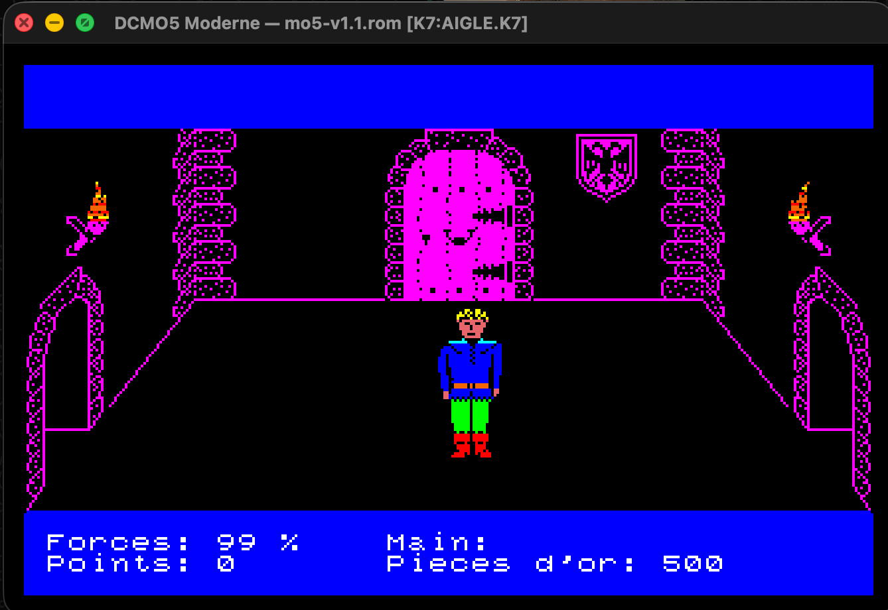
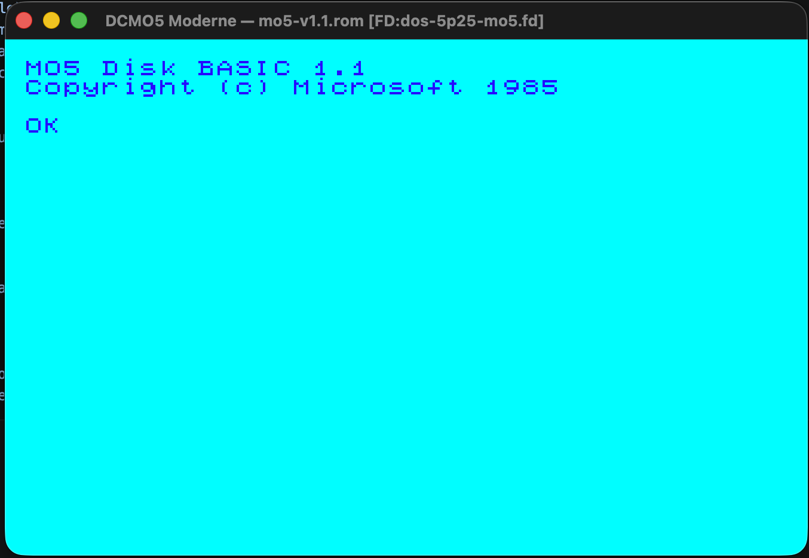

# DCMO5 Moderne

Portage moderne de l'émulateur Thomson MO5 [DCMO5 v11](http://dcmo5.free.fr/)
(C/SDL, 2007, © Daniel Coulom) vers **Go / Ebitengine**.

Ce projet est un logiciel libre sous licence **GNU GPL v3+**. Voir `LICENSE`
et `NOTICE`.

**Version : 1.0.0** (MO5) — historique dans [`CHANGELOG.md`](CHANGELOG.md). Une
**v2 multi-machines (TO8D) est en développement** (voir la section dédiée plus bas).

## Captures d'écran

| Jeu cassette (`.k7`) | DOS disquette (CD90-640) |
|:--:|:--:|
|  |  |

---

## Périmètre v1

### Fonctionnalités émulées

- **Vidéo** MO5 (framebuffer logique 336×216, palette Thomson, timing faisceau/IRQ 50 Hz)
- **Audio** mono (haut-parleur 1 bit, échantillonné à 48 kHz)
- **Clavier MO5** *layout-safe* (AZERTY/QWERTY) : les touches sont **maintenues**
  (jeux + répétition) ; mapping clavier hôte
- **Joysticks** émulés au clavier
- **Cassette** `.k7`, **disquette** `.fd` (densité variable + DOS contrôleur CD90-640),
  **cartouche** MEMO5 `.rom`
- **Menu de pilotage in-app** (touche `Échap`) : charger/éjecter cassette,
  disquette, cartouche ; Reset / Init prog
- **Médias à chaud** : montage/éjection sans relancer l'émulateur
- **Saisie programmée** `--exec` (taper une séquence au démarrage) et
  **copier-coller** depuis le presse-papier (`Cmd+V` / `Ctrl+V`)
- **Imprimante** parallèle vers fichier
- Préférences utilisateur portables (Windows / macOS / Linux)
- ROM système, ROM contrôleur CD90-640 et logiciels MO5 **inclus dans le dépôt**
  (sous réserve — voir [`DESIGN/LICENSING.md`](DESIGN/LICENSING.md))

### Limites connues

- **Crayon optique** : la routine bas niveau (souris → coordonnées MO5) est en
  place, mais la fonction BASIC `PEN(...)` **ne suit pas la souris**. La ROM MO5
  dérive la position d'un **handshake matériel du crayon optique** (synchro
  faisceau) que la version moderne n'émule pas — comportement **identique à
  dcmo5 v11**, qui ne fait pas non plus suivre la souris à `PEN`. Voir
  [issue #86](https://github.com/Lesur-ai/dcmo5/issues/86) (amélioration future).

### Exclusions explicites de la v1

Les extensions suivantes **ne sont pas émulées**, conformément au périmètre de
DCMO5 v11 :

- Nanoréseau Leanord
- Quick Disk Drive QD90-128
- Contrôleur IN57-001
- Contrôleur DI90-011
- Toute extension assimilée

---

## En développement (v2) — multi-machines

Un chantier de généralisation **multi-machines** est en cours pour émuler d'autres
machines Thomson au-delà du MO5, avec pour première cible le **TO8D** : architecture
de profils de machine + moteur d'émulation partagé, base TO8D (gate-array
mémoire/vidéo/timer/E/S + clavier), clavier généralisé *data-driven* et IHM
*data-driven* (ebitenui, cross-compilation Windows `CGO_ENABLED=0`).

> ⚠️ **La v2 n'est pas encore utilisable de bout en bout** : l'IHM de sélection de
> machine et le profil TO8D final sont en cours. Le **MO5 (v1) décrit ci-dessus
> reste pleinement fonctionnel et inchangé**.

Suivi dans l'épopée [#106](https://github.com/Lesur-ai/dcmo5/issues/106) ; conception
détaillée dans [`DESIGN/MACHINE_PROFILES.md`](DESIGN/MACHINE_PROFILES.md). Le détail
des évolutions est tenu dans [`CHANGELOG.md`](CHANGELOG.md) (section « Non publié »).

---

## Architecture

```
cmd/dcmo5
  └── internal/app        (Ebitengine : fenêtre, input, audio, prefs)
       └── internal/core  (machine MO5 : bus, RAM/ROM, ports, timing, IRQ)
            ├── internal/cpu6809  (Motorola 6809, pur Go, sans UI)
            ├── internal/media    (cassette, disquette, cartouche, imprimante)
            └── internal/spec     (constantes matérielles, adresses, codes touches)
```

Le cœur d'émulation (`core`, `cpu6809`, `media`, `spec`) ne dépend d'aucune
bibliothèque graphique, audio ou fichier. Ebitengine est limité à la couche
application. *(Schéma du cœur MO5 v1.)*

> **v2 (en cours)** : la généralisation multi-machines ajoute `internal/machine`
> (profils + registre), `internal/engine` (boucle d'émulation partagée),
> `internal/keyboard` (clavier *data-driven*) et `internal/uimodel` (IHM
> *data-driven*), avec le gate-array TO8D sous `internal/machine/gatearray`. La
> direction de dépendance (cœur sans UI) est préservée. Détails dans
> [`DESIGN/MACHINE_PROFILES.md`](DESIGN/MACHINE_PROFILES.md).

Voir [`DESIGN/ARCHITECTURE.md`](DESIGN/ARCHITECTURE.md) pour les décisions
structurantes.

---

## ROM et médias

Pour que l'émulateur soit **utilisable immédiatement**, ce dépôt inclut :

- `rom/` — ROM système **MO5** (`mo5-v1.1.rom`) et ROM du contrôleur de disquette
  **CD90-640** (`cd90-640.rom`) ;
- `software/` — une sélection de **logiciels MO5 historiques** (`.k7`, `.fd`, `.rom`).

> **Provenance & droits.** Ces contenus proviennent du matériel et de l'écosystème
> Thomson MO5 (commercialisé en 1984) et de la communauté de préservation/émulation
> (notamment la distribution [DCMO5 v11](http://dcmo5.free.fr/) de Daniel Coulom).
> Compte tenu de l'ancienneté du matériel et de sa diffusion établie à des fins de
> préservation, le mainteneur les inclut comme raisonnablement redistribuables.
> **Ce n'est pas un avis juridique** et cela n'affirme pas un statut de domaine
> public établi. Tout ayant droit peut demander le retrait d'un contenu en
> **ouvrant une issue** sur le dépôt ; il sera retiré sans délai.

L'application peut aussi démarrer **sans ROM** (message « ROM manquante ») et
accepte l'import de vos propres fichiers. Détails : [`DESIGN/LICENSING.md`](DESIGN/LICENSING.md).

---

## Pré-requis

- **Go 1.26+** (voir `go.mod`)
- Plateformes de bureau supportées : **Windows 10/11**, **macOS** (arm64/amd64),
  **Linux** (amd64) — et plus largement toute cible supportée par Go et Ebitengine.

Le cœur est en Go pur et le rendu passe par **Ebitengine** (multi-plateforme) :
DCMO5 Moderne tourne **nativement** sur les trois OS de bureau.

### Windows — supporté nativement

Aucune dépendance système à installer (Ebitengine utilise l'API graphique native
de Windows). Avec [Go 1.26+](https://go.dev/dl/) :

```powershell
# Lancer depuis la racine du dépôt
go run ./cmd/dcmo5 -rom rom\mo5-v1.1.rom

# Ou construire un exécutable
go build -o dcmo5.exe ./cmd/dcmo5
dcmo5.exe -rom rom\mo5-v1.1.rom -tape software\yahtzee-mo5.k7
```

### macOS — supporté nativement

Aucune dépendance à installer ; `go run ./cmd/dcmo5 -rom rom/mo5-v1.1.rom`.

### Linux — dépendances système (Ebitengine)

Ebitengine requiert des bibliothèques graphiques système absentes des
environnements CI headless. Pour un build et des tests locaux sur Linux :

```bash
# Debian / Ubuntu
sudo apt-get install -y \
  libgl1-mesa-dev \
  libx11-dev \
  libxcursor-dev \
  libxi-dev \
  libxinerama-dev \
  libxrandr-dev \
  libxxf86vm-dev

# Fedora / RHEL
sudo dnf install -y \
  mesa-libGL-devel \
  libX11-devel \
  libXcursor-devel \
  libXi-devel \
  libXinerama-devel \
  libXrandr-devel \
  libXxf86vm-devel
```

> **CI headless :** `internal/app` initialise Ebitengine (GLFW) et n'est donc
> pas exécuté dans la suite headless — la CI lance `go test -race` sur tous les
> autres paquets, et ne teste de `internal/app` que ses fonctions pures.
> `go build ./...` requiert les libs ci-dessus sur Linux.

## Utilisation

### Démarrage rapide

La ROM et des logiciels étant inclus dans le dépôt, l'émulateur est utilisable
immédiatement (lancé depuis la racine du projet) :

```bash
# BASIC (la ROM rom/mo5-v1.1.rom est trouvée automatiquement)
go run ./cmd/dcmo5 -rom rom/mo5-v1.1.rom

# Charger un jeu cassette
go run ./cmd/dcmo5 -rom rom/mo5-v1.1.rom -tape software/yahtzee-mo5.k7

# Démarrer le DOS depuis une disquette (ROM contrôleur cd90-640.rom auto-détectée)
go run ./cmd/dcmo5 -rom rom/mo5-v1.1.rom -disk software/dos-5p25-mo5.fd

# Cartouche MEMO5
go run ./cmd/dcmo5 -rom rom/mo5-v1.1.rom -cart software/glouton-memo5.rom
```

> Le menu in-app (`Échap`) permet aussi de charger/éjecter les médias **à chaud**,
> sans relancer. Les chemins sont mémorisés dans la config utilisateur
> (`~/.config/dcmo5/config.json` sous Linux,
> `~/Library/Application Support/dcmo5/config.json` sous macOS).

### Options de ligne de commande

| Option | Description |
|--------|-------------|
| `-rom <fichier>` | ROM système MO5 (16 Ko) |
| `-tape <fichier>` | Cassette `.k7` à monter |
| `-disk <fichier>` | Disquette `.fd` à monter |
| `-cart <fichier>` | Cartouche MEMO5 `.rom` à monter |
| `-disk-rom <fichier>` | ROM du contrôleur CD90-640 (auto-détectée à côté de la ROM système si absente) |
| `-exec "<séquence>"` | Tape une séquence de touches au démarrage (`\n` = ENTRÉE, `\t` = TAB) |
| `-exec-delay <s>` | Délai avant `--exec`, le temps que l'invite BASIC apparaisse (défaut 3 s) |
| `-no-audio` | Désactive la sortie audio |

### Raccourcis clavier (hôte)

| Touche | Action |
|--------|--------|
| `Échap` | Ouvrir le menu de pilotage / revenir en arrière |
| `F5` | Reset machine (efface la RAM) |
| `F3` | Pause / Reprise |
| `Cmd+V` / `Ctrl+V` | Coller le presse-papier (tapé dans le MO5) |
| Fermeture fenêtre | Quitter |

Dans le **menu** (`Échap`) : flèches pour naviguer, `Entrée` pour valider —
charger/éjecter cassette, disquette, cartouche ; `Init prog` (reset doux) ;
`Reset machine`.

### Saisie programmée (`--exec`) et copier-coller

`--exec` tape automatiquement une séquence après le boot (utile pour charger et
lancer un programme), et `Cmd+V`/`Ctrl+V` colle le presse-papier comme si vous
le tapiez :

```bash
# Taper puis exécuter un petit programme BASIC au démarrage
go run ./cmd/dcmo5 -rom rom/mo5-v1.1.rom -exec '10 CLS\n20 PRINT "BONJOUR"\nRUN\n'
```

### Tests

```bash
# Suite headless (exclut internal/app qui nécessite un affichage)
go test $(go list ./... | grep -v /internal/app)

# Tests longs avec la vraie ROM (boot BASIC, cassette, disquette…)
DCMO5_LONG_TESTS=1 go test ./internal/core/...
```

---

## Distribution

Des archives binaires pré-compilées sont disponibles dans les
[releases GitHub](https://github.com/Lesur-ai/dcmo5/releases) :

- **Windows amd64** : `dcmo5-windows-amd64.zip`
- **macOS** arm64 / amd64 : `dcmo5-darwin-{arm64,amd64}.tar.gz`
- **Linux amd64** : `dcmo5-linux-amd64.tar.gz`

```bash
# macOS / Linux
tar xzf dcmo5-darwin-arm64.tar.gz
./dcmo5-darwin-arm64 -rom /chemin/vers/mo5.rom
```

```powershell
# Windows : dézipper puis lancer
dcmo5-windows-amd64.exe -rom mo5-v1.1.rom
```

`dcmo5 -version` affiche la version du binaire.

Voir [`RELEASE.md`](RELEASE.md) pour la procédure de release complète.

## Contribuer

Workflow PR-only — tout merge vers `main` passe exclusivement par une Pull
Request GitHub. Le guide de contribution (`CONTRIBUTING.md`) sera ajouté dans
le milestone P0 (issue #12).

---

## Référence historique

Ce portage s'appuie sur DCMO5 v11 comme référence fonctionnelle et
documentaire. Le code C d'origine reste la référence ; il n'est pas une
dépendance runtime de la version moderne.
